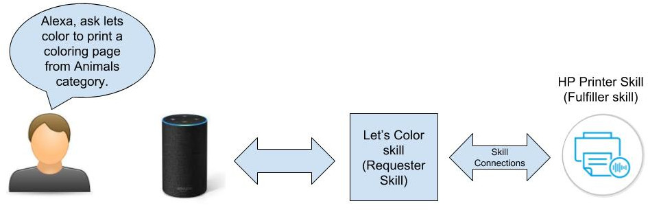
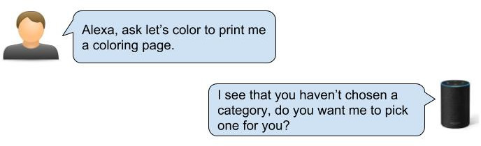
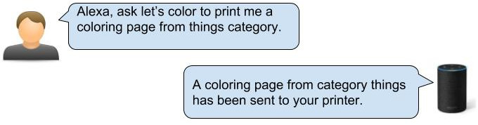
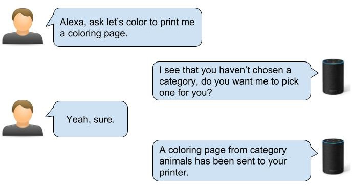
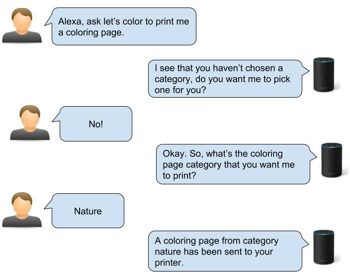

# Let’s Color Skill

This is a sample skill to ilustrate how to use the amazing Amazon [Skill Connections](https://developer.amazon.com/docs/custom-skills/skill-connections.html) to communicate with **HP Printer Skill** to send print jobs to your printer.

## Table of Contents
1. [Prerequisites](#prequisites)
2. [About the Skill](#about-the-skill)
3. [Creating the Skill](#creating-the-skill)
    1. [Intent](#intent)
    2. [Slot](#slot)
    3. [Handling ColoringPagesIntent](#handling-coloring-pages-intent)
    4. [Developing let’s color skill](#developing-lets-color-skill)
        1. [Implementing askToSortCategory method](#implementing-asktosortcategory-method)
            1. [Let's start with Yes](#yes)
            2. [What about No?](#no)
        2. [Implementing handleCategory method](#implementing-handlecategory-method)
        3. [Skill Connections](#skill-connections)
            1. [Update skill manifest](#update-skill-manifest)
4. [Deploying the skill](##deploying-the-skill)
5. [Closing Thoughts](#closing-thoughts)
5. [License](#license)


#### Prerequisites: <a name="prequisites"></a>
Make sure to:
 - Have an [Amazon Developer](https://developer.amazon.com/) account.
 - Have an [Amazon Web Services (AWS)](https://aws.amazon.com/) account. This tutorial uses AWS Lambda to host the skill
 - Have read the Amazon guide [Developing your first skill](https://alexa-skills-kit-sdk-for-java.readthedocs.io/en/latest/Developing-Your-First-Skill.html). It can help to understand better some concepts described in this guide.

1. #### About the skill:<a name="about-the-skill"></a>
    Let’s create a skill that has a real purpose. The goal here is to show how to communicate and request a job to 
    HP printer skill from another skill. For that our skill will need to have printable content. So, the content that our 
    skill will provide will be coloring pages. Let’s call our skill as *“let’s color”*, or known as *requester skill*.\
    So our flow will look like:
    
    The image is self explanatory, but as you can see, the way our skill will communicate with HP Printer skill is made by 
    Amazon Skill Connections. 

2. #### Creating the skill:<a name="creating-the-skill"></a>
    For this tutorial, our skill will be written in `Java` language using the [official SDK](https://github.com/alexa/alexa-skills-kit-sdk-for-java) 
    that Amazon provides us. The interaction between the user and Alexa should be simple but we’ll have to handle unpredictable situations 
    (Not so unpredictable).
    1. #### Intent:<a name="intent"></a>
        Our skill has only one custom Intent which should handle every Coloring Pages interaction. Let’s call it *ColoringPagesIntent*.\
        We also need to include `Amazon.YesIntent` and `Amazon.NoIntent` [built in intents](https://developer.amazon.com/docs/custom-skills/standard-built-in-intents.html#available-standard-built-in-intents).\
        The `Amazon.FallbackIntent`, `Amazon.StopIntent` and `Amazon.CancelIntent` should be already there after the skill creation.

        The "Yes" and "No" intents we'll be using in interaction. The "Fallback" intent is for when Alexa does not 
        understand clearly what the user said. The last two intentions are for close the skill elegantly.

        And finally our main custom Intent: *ColoringPagesIntent*.\
        We’re going to accept two ways of asking for coloring pages:\
        Specifying the category of coloring pages or just ask for a coloring pages without specifying the category.
        For that let's create some samples to train the model properly.

        Let's take a look at the interaction model:
        ```json
        {
          "interactionModel": {
            "languageModel": {
              "invocationName": "lets color",
              "intents": [
                {
                  "name": "AMAZON.FallbackIntent",
                  "samples": []
                },
                {
                  "name": "AMAZON.CancelIntent",
                  "samples": []
                },
                {
                  "name": "AMAZON.HelpIntent",
                  "samples": []
                },
                {
                  "name": "AMAZON.StopIntent",
                  "samples": []
                },
                {
                  "name": "AMAZON.NavigateHomeIntent",
                  "samples": []
                },
                {
                  "name": "ColoringPagesIntent",
                  "slots": [
                    {
                      "name": "COLORING_PAGE_TYPE",
                      "type": "COLORING_PAGE_TYPE"
                    }
                  ],
                  "samples": [
                    "print me a {COLORING_PAGE_TYPE}",
                    "{COLORING_PAGE_TYPE} category",
                    "print me a {COLORING_PAGE_TYPE} category",
                    "{COLORING_PAGE_TYPE}",
                    "print {COLORING_PAGE_TYPE} coloring page",
                    "print coloring pages from category {COLORING_PAGE_TYPE}",
                    "coloring page of {COLORING_PAGE_TYPE}",
                    "print coloring pages {COLORING_PAGE_TYPE}",
                    "print a {COLORING_PAGE_TYPE} coloring page",
                    "I want to color",
                    "I want a coloring page",
                    "print me coloring pages",
                    "print me a coloring page",
                    "get me a coloring page",
                    "coloring page",
                    "coloring pages",
                    "print coloring pages",
                    "print a coloring page"
                  ]
                },
                {
                  "name": "AMAZON.YesIntent",
                  "samples": []
                },
                {
                  "name": "AMAZON.NoIntent",
                  "samples": []
                }
              ],
              "types": [
                {
                  "name": "COLORING_PAGE_TYPE",
                  "values": [
                    {
                      "id": "THINGS",
                      "name": {
                        "value": "THINGS",
                        "synonyms": [
                          "Stuff",
                          "Objects"
                        ]
                      }
                    },
                    {
                      "id": "NATURE",
                      "name": {
                        "value": "NATURE",
                        "synonyms": [
                          "nature"
                        ]
                      }
                    },
                    {
                      "id": "ALPHABET",
                      "name": {
                        "value": "ALPHABET",
                        "synonyms": [
                          "letters",
                          "letter"
                        ]
                      }
                    },
                    {
                      "id": "FRUITS",
                      "name": {
                        "value": "FRUITS",
                        "synonyms": [
                          "fruit"
                        ]
                      }
                    },
                    {
                      "id": "ANIMALS",
                      "name": {
                        "value": "ANIMALS",
                        "synonyms": [
                          "animal"
                        ]
                      }
                    }
                  ]
                }
              ]
            }
          }
        }
        ```

    2. #### Slot:<a name="slot"></a>
        Now it's time to create a slot, so we can use it in our Custom Intent.
        Let’s call it `COLORING_PAGE_TYPE`. The slot values that we’re going to accept are: `ANIMALS`, `FRUITS`, `ALPHABET`, `NATURE` and `THINGS`.

        Don’t forget to add the slot to the intent. We’re using *COLORING_PAGE_TYPE* as name as well.

    3. #### Handling ColoringPagesIntent:<a name="handling-coloring-pages-intent"></a>
        Okay, the first thing we need to have in mind is the fact that user can or cannot specify the kind of category he wants.
        Based on that, if the user does not specify a category, we’ll ask if we can pick a category for him. 
        In other words, we’ll sort the available categories and pick one. **OR** we’ll just get the category he said and then send to the printer.

        Then the interaction should be as follows:

        

        **OR**

        

        Very simple.
        
    4. #### Developing let’s color skill:<a name="developing-lets-color-skill"></a>
        After setting up the invocation name, endpoint, intents and slot, we’re ready to implement the code.\
        If you just want to look at the code, you can find it [here](https://github.azc.ext.hp.com/IoT-Voice/lets-color-skill).         

        Let’s implement our class then.\
        The first method that we need to implement is the `canHandle` so we can tell the SDK that we’re handling all 
        requests coming from *ColoringPagesIntent*.

        ```java
        public class ColoringPagesIntentHandler implements RequestHandler {
            @Override
            public boolean canHandle(HandlerInput handlerInput) {
                return handlerInput.matches(Predicates.intentName("ColoringPagesIntent"));
            }

            @Override
            public Optional<Response> handle(HandlerInput handlerInput) {
                return Optional.empty();
            }
        }
        ```
        Okay, now we need to implement the `handle` method, which is basically what we are going to do to fulfill the 
        user's intention.\
        In our case, first we need to verify whether the user has provided a category or not before sending the 
        coloring page to HP Printer Skill.

        We can get the slots from the payload in the same way as we got the locale. 
        The intent object has all the slots that we configured for our skill on the Alexa console. It’s a `Map<String, Slot>` 
        where you get the slot through the `get` method.\
        Since we’ve set *COLORING_PAGE_TYPE* as the name of the slot, we just call the `get` method of the Map passing 
        the name of the Slot.\
        Now we only need to check whether the category is null or not.\
        We can also check if Alexa was able to map what the user said to a specific slot. 
        ```
        Slot coloringPageType = slots.get(COLORING_PAGE_TYPE);
        if (coloringPageType != null && coloringPageType.getResolutions() != null
              && coloringPageType.getResolutions().toString().contains("ER_SUCCESS_MATCH")) {
             return handleCategory(handlerInput, locale, coloringPageType);
        }
        return askToSortCategory(handlerInput, locale);
        ```

        **Internationalizing:**
        
        Since Java allows us to internationalize in a very simple way and the payload that Alexa sends us always come 
        with the locale, why not implement it?\
        We can retrieve user’s locale by getting the locale coming from the payload, which is now converted to 
        `RequestEnvelope` class. This object has pretty much everything that comes from Alexa JSON payload. 
        After, we can get the locale object by calling the `Locale.forLanguageTag` method.
        ```
        Request request = handlerInput.getRequestEnvelope().getRequest();
        IntentRequest intentRequest = (IntentRequest) request;
        Intent intent = intentRequest.getIntent();
        Locale locale = Locale.forLanguageTag(intentRequest.getLocale());
        ```
        Now with locale, we are able to internationalize using the `ResourceBundle` class. Let's create a Helper class 
        that will get the corresponding String from a given key.
        This helper will be called `I18nResource` and to get a String, we call `getString` method passing the key and locale:
        `I18nResource.getString("welcome", locale);`
        
        So far, the code looks like this:
        ```java
        @Override
        public Optional<Response> handle(HandlerInput handlerInput) {
            Request request = handlerInput.getRequestEnvelope().getRequest();
            IntentRequest intentRequest = (IntentRequest) request;
            Intent intent = intentRequest.getIntent();
            Locale locale = Locale.forLanguageTag(intentRequest.getLocale());
            Map<String, Slot> slots = intent.getSlots();
            Slot coloringPageType = slots.get(COLORING_PAGE_TYPE);
        
            if (coloringPageType != null && coloringPageType.getResolutions() != null
                    && coloringPageType.getResolutions().toString().contains("ER_SUCCESS_MATCH")) {
                return handleCategory(handlerInput, locale, coloringPageType);
            }
            return askToSortCategory(handlerInput, locale);
        }
        ```
        After this validation, we are able to implement each response properly.

        1. #### Implementing `askToSortCategory` method:<a name="implementing-asktosortcategory-method"></a>
            This method corresponds to when user has **not** specified a category.\
            There's no secret in this method, we'll just need to ask the user if he wants us to pick a category for him.

            ```java
            private Optional<Response> askToSortCategory(HandlerInput handlerInput, Locale locale) {
                 handlerInput.getAttributesManager().setSessionAttributes(Collections.singletonMap(SHOULD_PICK_CATEGORY, true));

                 String speechText = I18nResource.getString("ask_type", locale);
                 String speechTextRepromt = I18nResource.getString("ask_type_reprompt", locale);
                 return handlerInput.getResponseBuilder()
                         .withSpeech(speechText)
                         .withReprompt(speechTextRepromt)
                         .withShouldEndSession(false)
                         .build();
            }
            ```
            Easy enough. The only thing to note here, is that we are setting to the session attributes the flag
            *SHOULD_PICK_CATEGORY* with **true** value. We're doing this so we can known that the user has passed to this
            part of the interaction. 

            Now that we have asked the user, we need to wait for his answer, our question kind of forces
            him to answer "Yes" or "No", but nothing stop the user from saying anything else. That's why we have to have the
            `AMAZON.FallbackIntent`, to handle those undesired answers gracefully. Let's focus on "Yes/No" answers which are 
            the acceptable answers for us.

            1. ##### Let's start with Yes:<a name="yes"></a>
                So the flow would be as follows:
                
                
                So when the user says "yes", Alexa will send us the Intent `AMAZON.YesIntent`.
                We should be ready to handle that by creating a RequestHandler that handles the Yes Intent.
                So, now that we known the user wants us to pick a category, we'll sort/get a category, and then send to the 
                HP Printer Skill.

                In this example, for comprehension sake, we've created a separated handler for YesIntent, the `YesIntentHandler`.
                This Handler is also pretty simple.
                ```java
                public class YesIntentHandler implements RequestHandler {

                    @Override
                    public boolean canHandle(HandlerInput handlerInput) {
                        return handlerInput.matches(Predicates.intentName("AMAZON.YesIntent"));
                    }

                    @Override
                    public Optional<Response> handle(HandlerInput handlerInput) {
                        Locale locale = Locale.forLanguageTag(handlerInput.getRequestEnvelope().getRequest().getLocale());

                        Map<String, Object> sessionAttributes = handlerInput.getAttributesManager().getSessionAttributes();
                        Boolean shouldChooseCategory = (Boolean) sessionAttributes.get(SHOULD_PICK_CATEGORY);

                        if (shouldChooseCategory == null || !shouldChooseCategory) {
                            String speechText = I18nResource.getString("yes_with_no_context", locale);
                            return handlerInput.getResponseBuilder()
                                    .withSpeech(speechText)
                                    .withShouldEndSession(true)
                                    .build();
                        }

                        ColoringPagesResource resource = ColoringPagesResource.pickResource();
                        return ColoringPagesIntentHandler.sendToHPPrinter(handlerInput.getResponseBuilder(), locale, resource);
                    }
                }
                ```
                Note that we're getting the flag *SHOULD_PICK_CATEGORY* from the session attributes, with this value, we known
                the user has passed to the first part of the interaction. If it's `true`, he allowed us to select a category,
                otherwise it means that he said "yes" with no context, for example: he opened the skill and said "yes".
                After we get a random category we can send it to the **HP Printer Skill** which is exactly what the method 
                `sendToHpPrinter` does which we'll check in a minute.

            2. ##### What about No?<a name="no"></a>
                Here's the flow:
                

                If a user says "No", it means he does not want us to pick the category, he prefers to choose a category.
                Alexa will send us `AMAZON.NoIntent`, let's handle it with `NoIntentHandler`.

                ```java
                public class NoIntentHandler implements RequestHandler {

                    @Override
                    public boolean canHandle(HandlerInput handlerInput) {
                        return handlerInput.matches(Predicates.intentName("AMAZON.NoIntent"));
                    }

                    @Override
                    public Optional<Response> handle(HandlerInput handlerInput) {
                        Locale locale = Locale.forLanguageTag(handlerInput.getRequestEnvelope().getRequest().getLocale());

                        return handlerInput.getResponseBuilder()
                                .withSpeech(I18nResource.getString("no_message", locale))
                                .withShouldEndSession(false)
                                .build();
                    }
                }
                ```
                Again nothing new in this class, we're just asking the user what category he wants. If the user answer the question
                correctly, it'll trigger the `ColoringPagesIntent` with the category slot populated properly, otherwise it'll
                again trigger the `AMAZON.FallbackIntent`.\
                That's it for `askForCategory` method. Let's move on to `handleCategory` method.

        2. #### Implementing `handleCategory` method:<a name="implementing-handlecategory-method"></a>
             ```
             static Optional<Response> sendToHPPrinter(ResponseBuilder responseBuilder, Locale locale, ColoringPagesResource resource) {
                 String url = UrlUtils.pickUrl(resource.urls());
                 String name = UrlUtils.getNameFromUrl(url);
                 String resourceName = resource.capitalizeName();
 
                 String speechText = String.format(I18nResource.getString("sent_message", locale), resourceName);
                 String cardTitle = I18nResource.getString("title_card", locale);
                 String cardText = I18nResource.getString("sent_message_card", locale);
 
                 return responseBuilder
                         .withSpeech(speechText)
                         .withSimpleCard(cardTitle, cardText)
                         .addDirective(hpPrinterDirective(name, url, resource, locale))
                         .build();
                 }
             ```
             No big deal here, just getting the name and url of the given category, then get the text and text card from our 
             message resources and then prepare to return to Alexa the message. 
             But this time we're adding a [directive](https://developer.amazon.com/docs/alexa-voice-service/interaction-model.html#interfaces)
             and calling `hpPrinterDirective` method which is responsible for doing `Skill Connections` magic.
         
        3. #### Skill Connections:<a name="skill-connections"></a>
        
            The `hpPrinterDirective` method is where the "magic" happens. It's where we're going to ask Alexa to 
            communicate with HP Printer Skill through [`Skill Connections`](https://developer.amazon.com/docs/custom-skills/skill-connections.html) 
            feature to print the selected coloring page.
            Basically the `hpPrinterDirective` method returns a Directive, a `SendRequestDirective` to be more specific.
            This `SendRequestDirective` is responsible to tell Alexa that we want to delegate a job to other capable skills,
            in this case delegate a coloring page to HP Printer Skill to print.

            The`SendRequestDirective` requires three parameters: name, payload and token. Name corresponds to the name of
            the connection (PRINT, SCHEDULE..). Payload contains the required attributes for the connection name you 
            are sending. And token that is a value that comes back to our skill as-is when we receive a response for 
            Alexa regarding the execution of the HP Printer skill.
 
            The Payload is pretty tied to the connection Name. Which means that there are different
            attributes for each kind of connection. For sending jobs to be printed to HP Printer Skill, we'll be working with
            connection name **"PRINT"**. So the acceptable attributes for this connection name are:
            - **@version**
            - **@type**: *PrintImageRequest*, *PrintPDFRequest*, *PrintWebPageRequest*
            - **title**: Title of the document to be printed
            - **description**: description of the document to be printed
            - **url**: url of the document to be printed

            Let's take a look at the `hpPrinterDirective` method and the payload creation:
            ```java
            private static SendRequestDirective hpPrinterDirective(String name, String url, ColoringPagesResource resource, Locale locale) {
                String extension = UrlUtils.getExtensionFromUrl(url);
                Map<String, Object> payload = generatePayload(extension, name, url, resource, locale);

                return SendRequestDirective.builder()
                        .withName(PRINT_NAME)
                        .withToken(COLORING_PAGES_TOKEN)
                        .withPayload(payload)
                        .build();
            }

            private static Map<String, Object> generatePayload(String extension, String name, String url,
                                                               ColoringPagesResource resource, Locale locale) {
                String requestType = getRequestType(extension);
                Map<String, Object> payload = new HashMap<>();
                payload.put(TYPE, requestType);
                payload.put(VERSION, "1");
                payload.put(TITLE, name);
                payload.put(DESCRIPTION, String.format(I18nResource.getString("category_of", locale), resource.name()));
                payload.put(URL, url);
                if (requestType.equals(PRINT_IMAGE_REQUEST)) {
                    payload.put(IMAGE_TYPE, extension.toUpperCase());
                }
                String providerId = System.getenv(PROVIDER_ID);
        
                if (providerId != null) {
                    Map<String, Object> context = new HashMap<>();
                    context.put(PROVIDER_ID, providerId);
                    payload.put(CONTEXT, context);
                }
                return payload;
            }
            ```

            Here's what Alexa should receive from our skill:
            ```json
            {  
               "directives":[  
                  {  
                     "type":"Connections.SendRequest",
                     "name":"Print",
                     "payload":{  
                        "@type":"PrintPDFRequest",
                        "@version":"1",
                        "title":"colorme_u_Printable_Page_Animals_Cow.pdf",
                        "description":"This is a coloring page from category Animals",
                        "url":"https://lets-color-skill.s3.us-west-2.amazonaws.com/Animals/colorme_u_Printable_Page_Animals_Cow.pdf"
                     },
                     "token":"ColoringPages"
                  }
               ]
            }
            ```
            The first thing we create is the payload, which is nothing more than a `Map<String, Object>`. 
            We populate the required attributes with our coloring page information. After that, we generate the 
            `SendRequestDirective` through the `SendRequestDirectiveBuilder`, specifying that we want to use the 
            connection name PRINT. Then we put the payload and token into the builder and that's it!
            Our response is completely ready to be sent to Alexa, so it can be forwarded to HP Printer Skill.

            Alexa will ask us if we want to print the document using *HP Printer Skill*, and after we agree to use it,
            if you're linked, the HP Printer Skill will send a card with a link for on-boarding. There we can set our 
            printer email address. But if you're already linked, the document will be sent successfully to the HP Printer
            Skill which will do its job, which is print our coloring page!

            After the job is sent, Alexa will return to our skill a request containing the status of the process.
            If everything goes well, it'll be a success or else an error with description.

            Let's create a class to handle that.

            ```java
            @Override
            public class ConnectionsResponseIntentHandler implements RequestHandler {

                @Override
                public boolean canHandle(HandlerInput handlerInput) {
                    return handlerInput.matches(Predicates.requestType(ConnectionsResponse.class));
                }

                @Override
                public Optional<Response> handle(HandlerInput handlerInput) {
                    Request request = handlerInput.getRequestEnvelope().getRequest();
                    Locale locale = Locale.forLanguageTag(request.getLocale());
                    ConnectionsResponse connectionsResponse = (ConnectionsResponse) request;
                    String token = connectionsResponse.getToken();
                    if (!token.equals(COLORING_PAGES_TOKEN)) {
                        return Optional.empty();
                    }
                    String speechKeyText = connectionsResponse.getStatus().getCode().equals("200") ? "response_success" : "response_error";
                    String speechText = I18nResource.getString(speechKeyText, locale);
                    String cardTitle = I18nResource.getString("title_card", locale);
                    return handlerInput.getResponseBuilder()
                            .withSpeech(speechText)
                            .withSimpleCard(cardTitle, speechText)
                            .withShouldEndSession(true)
                            .build();
                }
            }
            ```

            We're just checking the status and respond to Alexa accordingly. Note that if you don't want to respond anything
            you can, just returning `Optional.empty()`. 

            ##### Update Skill Manifest<a name="update-skill-manifest"></a>
            Last thing we need to do, is to [register your our as a requester](https://developer.amazon.com/docs/custom-skills/skill-connections.html#register-skill)
            by updating the skill manifest, so it can be able to delegate jobs to HP Printer Skill.
                
            Here's what we need to do to update the manifest:
            1. Install the Alexa Skill Kit (ASK) CLI: https://developer.amazon.com/docs/smapi/quick-start-alexa-skills-kit-command-line-interface.html
            2. Log in with your account
            3. Get the current manifest of the skill and save to a file:\
            `ask api get-skill -s [APPLICATION_ID] > skill_manifest.json `
            4. Change the manifest adding the appropriate connection types you want to request:
               ```json
               "apis": {
                 "custom": {
                   "endpoint": {
                     "sslCertificateType": "certificate_type",
                     "uri": "https://endpoint_of_your_skill"
                   },
                   "interfaces": [
                     {
                       "type": "RENDER_TEMPLATE"
                     }
                   ],
                   "connections": {
                     "requires": [
                       {
                         "payload": {
                           "type": "PrintPDFRequest",
                           "version": "1"
                         },
                         "name": "Print"
                       },
                       {
                         "payload": {
                           "type": "PrintImageRequest",
                           "version": "1"
                         },
                         "name": "Print"
                       },
                       {
                         "payload": {
                           "type": "PrintWebPageRequest",
                           "version": "1"
                         },
                         "name": "Print"
                       }
                     ]
                   }
                 }
               }, 
               ```
            - Update the skill manifest with the new changes:\
              `ask api update-skill -s [APPLICATION_ID] -f skill_manifest.json`
        And that's it. Our skill is finally good to go!
            
3. #### Deploying the skill:<a name="deploying-the-skill"></a>
    Now that our skill is ready, we have to generate our *Jar* file so we can upload to AWS.
    For that we'll use the `maven-shade-plugin`:
    ```xml
    <build>
        ...
            <plugins>
                ...
                <plugin>
                    <groupId>org.apache.maven.plugins</groupId>
                    <artifactId>maven-shade-plugin</artifactId>
                    <version>3.2.0</version>
                    <executions>
                        <execution>
                            <phase>package</phase>
                            <goals>
                                <goal>shade</goal>
                            </goals>
                            <configuration>
                                <transformers>
                                    <transformer
                                            implementation="com.github.edwgiz.mavenShadePlugin.log4j2CacheTransformer.PluginsCacheFileTransformer">
                                    </transformer>
                                </transformers>
                            </configuration>
                        </execution>
                    </executions>
                    <dependencies>
                        <dependency>
                            <groupId>com.github.edwgiz</groupId>
                            <artifactId>maven-shade-plugin.log4j2-cachefile-transformer</artifactId>
                            <version>2.8.1</version>
                        </dependency>
                    </dependencies>
                </plugin>
                ...
            </plugins>
        ...
        </build>
    ```
    Now just run the maven command to package it:

    `mvn package`

    The artifact should be located at `$project/target/lets-color-1.0-SNATPSHOT.jar`  
    Please make sure to have an account and have followed [this steps](https://alexa-skills-kit-sdk-for-java.readthedocs.io/en/latest/Developing-Your-First-Skill.html#uploading-your-skill-to-aws-lambda)
    so you will be able to upload the *jar* file properly.

    That's it!

4. #### Closing Thoughts<a name="closing-thoughts"></a>
    I hope this guide was useful for you and can help you create a skill that sends jobs to **HP Printer
    Skill** to be printed.
    If you have any questions, comments or feedback feel try to contact us.
        
           

## License<a name="license"></a>

MIT -- see [LICENSE](LICENSE.md)
